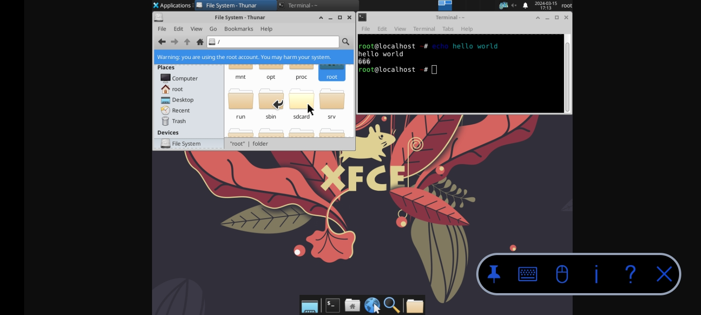

# chroot-distro
<p align="center">

  
  
</p>

chroot-distro: Installs Linux distributions in a chroot environment on Android.
+ Directory Structure
```
/data/local/chroot-distro/
├── .backup/
├── .rootfs/
├── <distro>/
└── <distro>/
```
System paths mount automatically, and the environment supports GUI applications through VNC or X11 forwarding.
___
## Requirements

### Rooted Android Device
All root implementations are compatible.

You can use chroot-distro on any terminal, for example: MiXplorer, MT Manager, Termux, TWRP and Android Terminal Emulator (ADB Shell).

### Busybox for Android NDK
You need a recent version of the "Busybox for Android NDK by osm0sis" Magisk module installed.
* **Recommended:** v1.36.1 is confirmed to work.
* **Avoid:** v1.32.1 is known to cause issues.
* **Important:** Using an outdated version can lead to problems, such as difficulties downloading the rootfs.

### Alternative Busybox
Using the Busybox provided by:
* Magisk/KernelSU/APatch 
(without the "Busybox for Android NDK" module) is supported by the community, but it might introduce bugs during use.

## Android Paths

### System Points
```
/chroot-distro/<distro>
├── /dev
├── /sys
├── /proc
├── /dev/pts
├── /sdcard
└── /storage
```

### Optional Mounts
use `-a` or `--android` flag:
```
├── /system   (Not mounted by default)
└── /data     (Not mounted by default)
```

## Usage Warning

### Notice
chroot-distro requires root access to function. While running as root:
* There's a small possibility of unintended file deletion
* System files could be accidentally modified
* Corner cases might exist despite thorough testing

### Careful
Before running chroot-distro:
* Always backup your important files
* Always backup your system partitions

### Remember
This warning applies to all root-level operations, not just chroot-distro.

As they say: ***With great power comes great responsibility.***

## Commands Usage

### Basic Commands

```
# Show all commands and usage
chroot-distro help

# Display environment details
chroot-distro env

# Show available distributions
chroot-distro list

# Download a new distribution
chroot-distro download <distro>

# Refresh existing distribution
chroot-distro redownload <distro>

# Remove distribution
chroot-distro delete <distro>
```

### Usage Examples
```
chroot-distro download ubuntu
chroot-distro redownload debian
chroot-distro delete ubuntu
```
>*Replace `<distro>` with your chosen distribution identifier*

### Installation Commands
```
# Basic installation
chroot-distro install <distro>
# Install with Android mounts
chroot-distro install --android <distro>

# Reinstall distribution
chroot-distro reinstall <distro>
# Force reinstall with Android mounts
chroot-distro reinstall --android --force <distro>

# Remove distribution
chroot-distro uninstall <distro>
# Force uninstall
chroot-distro uninstall --force <distro>
```
Usage Note:
+ By default, Optional mounts (/data, /system) are not mounted. Use `-a` or `--android` flag to mount them.

+ The reinstall process will stop if files are open or mounts are active. Using `-f` or `--force` will close running processes and unmount active points. For safety, first run without force to see what's running before using the force option.

### Backup Operations
```
# Create backup
chroot-distro backup <distro> [path]
# Remove backup
chroot-distro unbackup <distro>

# Restore backup
chroot-distro restore <distro> [path]
# Restore to defaults
chroot-distro restore --default <distro>
```
Usage Note:
+ Restores backup in its current state. Use `-d` or `--default` to restore original install settings.
+ Optional: Specify custom path to restore from.
+ For old backups: `--force` may be needed, but review first to avoid issues like:
  * System mount conflicts
  * Storage space problems

### Unmount Paths
```
# Unmount system points
chroot-distro unmount <distro>
# Force unmount all points
chroot-distro unmount --force --all <distro>
```
Usage Note:
+ Stops if unmount fails. Use `-f` or `--force` to:
  * Close any process trying to access system points
  * Unmount any active system points forcefully
+ By default: Only unmounts system points
+ Use `-a` or `--all` to unmount everything (system, normal, and loopback mounts)

### Execute Commands
```
# Run specific command
chroot-distro command <distro> "command"

# Login to distro
chroot-distro login <distro>
```
Usage Note:
+ Execute Commands:
   ```
   chroot-distro command <distro> "command"
   ```
   * Runs a command within specified distro
   * Commands must be enclosed in quotes
   * Executes and returns to host system

### Usage Examples
```
chroot-distro download ubuntu
chroot-distro install ubuntu
chroot-distro install --android debian
chroot-distro login ubuntu
chroot-distro command debian "sudo -i -u root" 
```
>*Replace `<distro>` with your chosen distribution identifier.*

## Supported Distributions
Note: Use lowercase identifiers for it to be properly identified.
| Distributions   | Identifiers     |
|----------------|-----------------|
| Kali Linux     | `kali`         |
| Parrot OS      | `parrot`       |
| Alpine Linux   | `alpine`       |
| Arch Linux     | `archlinux`    |
| BackBox        | `backbox`      |
| Centos         | `centos`       |
| Centos Stream  | `centos_stream`|
| Artix Linux    | `artix`        |
| Debian         | `debian`       |
| Deepin         | `deepin`       |
| Fedora 39      | `fedora`       |
| Manjaro        | `manjaro`      |
| OpenKylin      | `openkylin`    |
| OpenSUSE       | `opensuse`     |
| Pardus         | `pardus`       |
| Ubuntu         | `ubuntu`       |
| Void Linux     | `void`         |

## Download Releases

|   Versions  |   Releases   |
|-------------|--------------|
|   v1.3.0    | [Download](https://github.com/Magisk-Modules-Alt-Repo/chroot-distro/releases/download/v1.3.0/chroot-distro.zip) |
|   v1.4.0    | [Download](https://github.com/Magisk-Modules-Alt-Repo/chroot-distro/releases/download/v1.4.0/chroot-distro.zip) |
|   Latest    | [Download](https://github.com/Magisk-Modules-Alt-Repo/chroot-distro/releases/latest/download/chroot-distro.zip) |

Install via Manager or flash through custom recovery.

## Screenshot Examples


## TODO: How-to Instructions

### Fixing Sudo

By default Android prevents suid usage under `/data` folder. This will prevent using `sudo` inside the rootfs. There is a few alternatives how this can be solved:

1. Quick Remount  
Remount /data for the current process with needed capabilities
```
# Should be executed only once during setup, not on every login!
su -c "mount -o remount,dev,suid /data"
```

2. Image File Method
```
# Create image (adjust size as needed)
su -c truncate -S 15G /data/local/distros.img
su -c mke2fs -t ext4 /data/local/distros.img

# Mount after each reboot
su -c mount /data/local/distros.img /data/local/chroot-distro
```

3. SD Card Method  
https://xdaforums.com/t/mount-ext4-formatted-sd-card.3769344/
```
1. Format SD card with ext4
2. Mount to `/data/local/chroot-distro`
3. Remount after each reboot
```
Overall Note:
- Methods 2 & 3 are safer (prevent accidental command execution)
- SD Card Method advantages:
  - Saves internal storage space
  - Reduces wear on internal storage
  - Extends device lifespan
  - Note: You can't use it for Android stuff (at least by default)
---

### Desktop Environment with VNC




1. Install VNC app  
Download and install any VNC viewer app.
  * RealVNC Viewer
  * bVNC Pro
  * MultiVNC

2. Install Required Packages  
(Assuming you have already installed chroot-distro and set up it's chroot environment)  
Inside your chroot environment:
```
apt update
apt upgrade
apt install tightvncserver
apt install nano dbus-x11 xfce4 xfce4-goodies xfce4-terminal
```

3. Set Up Desktop Environment
```
# Configure Terminal
update-alternatives --config x-terminal-emulator

# Start VNC first time to create config
vncserver

# Stop the server
vncserver -kill :1

# Add XFCE to startup
echo 'startxfce4 &' >> ~/.vnc/xstartup
```

4. Launch Desktop Environment
```
# Start VNC
vncserver

# Stop VNC
vncserver -kill :1
```
---

### Desktop Environment with Termux-X11
1. Install Termux-X11  
Download and install Termux-X11 from the official repository:
  https://github.com/termux/termux-x11

2. Install Required Packages in Termux
First, open Termux and run these commands:
```
pkg install x11-repo
pkg install root-repo
pkg install tsu
pkg install ncurses-utils
pkg install termux-x11-nightly
pkg install pulseaudio
pkg install virglrenderer-android
```

3. Set Up Desktop Environment  
(Assuming you have already installed chroot-distro and set up it's chroot environment)  
Inside your chroot environment, Install XFCE4:
```
apt install xfce4

# Optional: Make sure to set up mpd.conf for music/audio server before running 'Audio Server'.
apt install mpd
```

4. Launch the Desktop Environment Easily

Note: Make sure to run the script in Termux.

Save this script as "chroot-xfce.sh" as it provides user-friendly menu and use it to launch your XFCE4 desktop environment later:
1. Download the provided code:  
[scripts/chroot-xfce.sh](https://github.com/Magisk-Modules-Alt-Repo/chroot-distro/tree/main/scripts/chroot-xfce.sh)

2. Make it executable:
```
chmod +x chroot-xfce.sh
```

3. Run the script:
```
./chroot-xfce.sh
or
bash chroot-xfce.sh
```

Once completed, you'll have a fully functional XFCE4 desktop environment with audio capabilities running through Termux-X11.

## Development Guide

If you want to help with development or test a bug report against the latest version, create a development build using:

```
zip chroot-distro.zip config.sh module.prop META-INF/com/google/android/* system/bin/chroot-distro
```

Alternative approaches:
- Enable SSH in a distro, update scripts remotely, and test against another distro (no reboot needed thus making the development quicker)
- Develop directly on the device (physically or via remote connection)

Testing requirements:
- Test all changes in Termux (or other terminals) AND Android terminal emulator (ADB Shell)
- Note: ADB Shell only has Busybox and Android Toybox commands, which may behave differently than Termux

Code quality:
- Use `ShellCheck` for POSIX compliance
- Document warning exceptions with `# shellcheck disable=SCXXXX` and explanatory comments
- For shell scripting guidance, refer to [Grymoire's tutorial](https://www.grymoire.com/Unix/Sh.html)

Error Detection: 

To enable command monitoring and stop on errors, use:
```
export chroot_distro_log=""
```
- Displays executed commands.
- Stops immediately on error with line number.

## Semantic Versioning

`chroot-distro` uses semantic versioning for version numbers. Versioning uses three levels: major, minor and patch. Major version changes when there are breaking changes in API. Minor version changes for new features (or significant changes that don't break compatibility). Patch version is only for bug fixes or very small changes (no breaking changes).

- **Major (X)**: Changes when API breaks compatibility
- **Minor (Y)**: Changes for new features (no compatibility breaks)
- **Patch (Z)**: Bug fixes and small updates (no breaking changes)

## Software License

This software is licensed under the GNU General Public License v3.0 (GPL-3.0). You are free to:
- Use, modify, and distribute this software
- Access and modify the source code
- Use for commercial purposes

Full license text: [GNU GPL v3](LICENSE)
